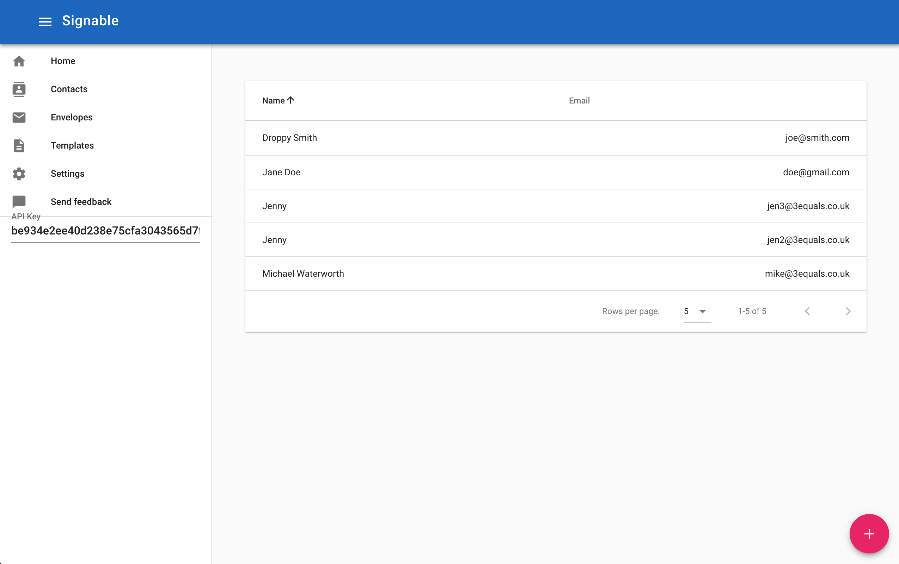

# signable API demo
A demo of using the signable API through a Swagger-generated client. This project is built on top of Vue-CLI v3, with the Vuetify UI library.



A JS API client was generated by writing Swagger API definitions based on the developer site documentation. This Swagger (OpenAPI) file is able to generate API clients for multiple platforms, and serves as great API documentation.


## Project setup
```
yarn install
```

### Compiles and hot-reloads for development
```
yarn run serve
```

### Compiles and minifies for production
```
yarn run build
```

### Lints and fixes files
```
yarn run lint
```

### Run your unit tests
```
yarn run test:unit
```

### Run your end-to-end tests
```
yarn run test:e2e
```
